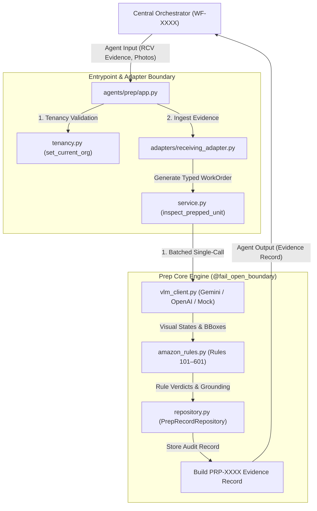

# agents/prep/ · Prep Manager (Agent 02)

**Owner:** Member 2 — Manideep (@Manideep667320) · [`PROVENANCE.md`](PROVENANCE.md)  
**Stage:** `prep`  
**Flow Trigger:** Evaluated on all FBA-routed units (`route == "fba"`).

The **Prep Manager** inspects outbound unit packaging against authoritative **Amazon FBA Inbound Prep Requirements (Rules 101–601)** before shipments leave the warehouse. It produces cryptographic, tamper-evident **`PRP-XXXX`** evidence records that downstream stages (specifically Agent 05 Recovery) use to dispute invalid Amazon inbound defect fees.

---

## 1. System Architecture & Workflow



---

## 2. Amazon FBA Compliance Rules (Rules 101–601)

The agent runs authoritative Amazon Seller Central packaging checks:

| Rule | Check Key | Requirement | Passing Values | Failing Values |
|---|---|---|---|---|
| **101** | `polybag_sealed` | Polybag present and completely hermetically sealed | `yes` | `not_sealed`, `missing` |
| **201** | `suffocation_warning` | Legible suffocation warning for bags with ≥5" opening | `legible` | `obscured_by_fold`, `missing` |
| **301** | `fnsku_label_placement` | FNSKU barcode label affixed flat on outer surface | `flat` | `on_seam`, `on_curve`, `on_edge`, `missing` |
| **401** | `original_barcode_covered`| Manufacturer UPC completely obscured | `yes` | `no` |
| **501** | `expiry_legible` | Perishable expiration date visible and legible after wrap | `legible` | `illegible_after_wrap` |
| **601** | `handling_marks` | Fragile / This-Way-Up markings present where required | `all_present` | `some_missing` |

*Note: Checks marked as `not_required` in the work order are excluded from evaluation to avoid spurious defects.*

---

## 3. Directory Layout

```text
agents/prep/
├── __init__.py                     # Package bootstrap & public exports
├── app.py                          # Contract entrypoint: handle() + FastAPI HTTP app
├── agent.json                      # Stage manifest, mode (inproc | http), and metadata
├── PROVENANCE.md                   # Round 2 source repository URL and commit hash
├── config.py                       # Settings: latency limits (800ms), prep economics ($0.40–$1.10)
├── schemas.py                      # Pydantic v2 data models: WorkOrder, PrepRecord, Checks, BBoxes
├── service.py                      # Core pipeline: inspect_prepped_unit()
├── amazon_rules.py                 # Deterministic Amazon Rules 101–601 engine
├── vlm_client.py                   # Batched vision client with fail-open fallback
├── fail_open.py                    # @fail_open_boundary decorator (800ms P95 limit)
├── repository.py                   # Tenant-isolated persistence (PrepRecordRepository)
├── runner.py                       # CLI test runner for terminal inspection
├── tenancy.py                      # Row-Level Security (RLS) & tenant isolation
│
├── adapters/                       # Cross-Agent Handshake Adapters
│   ├── receiving_adapter.py        # Maps RCV-XXXX evidence into Prep WorkOrder
│   ├── pack_adapter.py             # Prepares cartonization manifest for Agent 03 Pack
│   └── recovery_adapter.py         # Exports visual bounding-box proof for Agent 05 Recovery
│
├── events/                         # Asynchronous Messaging Adapters
│   ├── consumer.py                 # Subscribes to inbound.receiving.completed
│   └── publisher.py                # Emits inbound.prep.completed & inbound.prep.rework
│
└── tests/                          # Automated Test Suite & Eval Harness
    ├── test_prep_unit.py           # Unit tests (RLS, VLM, fail-open, Amazon rules)
    ├── test_receiving_handshake.py # Integration test: Receiving -> Prep
    ├── test_pack_gate.py           # Integration test: Prep -> Pack cartonization gate
    ├── test_recovery_export.py     # Integration test: Prep -> Recovery dispute proof
    └── run_eval.py                 # 50-unit held-out benchmark evaluation harness
```

---

## 4. Key Design Patterns & Invariants

1. **Single Batched VLM Call:**  
   Calls the vision model once per unit carrying all checks and bounding box extractions simultaneously to satisfy the warehouse packing line 800ms P95 latency ceiling.
2. **Fail-Open Resilience (`@fail_open_boundary`):**  
   If the vision model times out or encounters network degradation, the agent degrades gracefully to an `UNCERTAIN` verdict (`status: "pending_review"`), preventing conveyor belt stoppages while alerting human auditors.
3. **Strict Tenancy Isolation:**  
   `set_current_org()` scopes all operations to the authenticated tenant (`org_demo_alpha` or `org_demo_bravo`). Requests across unauthorized tenant boundaries immediately raise `LookupError` (HTTP 404).
4. **Visual Grounding Traceability:**  
   Every check produces bounding coordinates (`[ymin, xmin, ymax, xmax]`) and confidence ratings, giving the Recovery Manager photographic proof to contest dispute fees.
5. **Cost Economics:**  
   Total inspection cost is capped within the operational range of **$0.40–$1.10** per unit.

---

## 5. How to Run & Test

### Run Standalone via HTTP

```powershell
uvicorn agents.prep.app:app --port 8102
```

Check health:
```powershell
curl http://localhost:8102/health
```

### Run Internal Unit & Integration Tests

```powershell
python -m pytest agents/prep/tests
```
*(Runs all 9 tests covering rule logic, VLM fallbacks, tenant RLS, and handshake adapters).*

### Run the 50-Unit Held-Out Evaluation Benchmark

```powershell
python -m agents.prep.tests.run_eval
```
Evaluates accuracy across 50 held-out units against Amazon defect classes with safety gates (`False PASS < 1.5%`).

### Run Standalone CLI Bench Test

```powershell
python -m agents.prep.runner --unit UNIT-0014 --org org_demo_alpha
```

### Run Cross-Agent Orchestration Contract Tests

```powershell
python -m pytest tests/integration/test_agent_contracts.py
```
Verifies contract conformance, output schema validation, and recovery override propagation across all five Pod agents.
