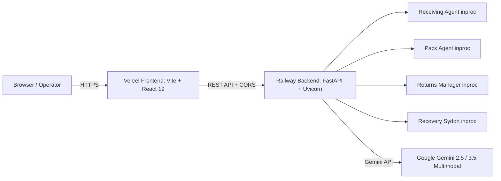

# Production Deployment Guide: Vercel & Railway

This guide details the exact steps to deploy the CUBE Round 3 Specialist Pod (Pod 15) to **Vercel** (Frontend) and **Railway** (Backend Orchestration & Agents).

---

## Architecture Overview



- **Frontend (Vercel)**: Single Page Application built with React 19, TypeScript, Vite, and Tailwind CSS v4. Located in `/frontend`.
- **Backend (Railway)**: FastAPI orchestrator running in Python 3.12/3.13. All 4 Specialist Pod agents (Receiving, Pack, Returns, Recovery) run **in-process** (`mode: "inproc"`), eliminating microservice network overhead.

---

## 1. Backend Deployment: Railway

### A. Railway Project Setup
1. Log in to [Railway](https://railway.app/).
2. Click **New Project** → **Deploy from GitHub repo**.
3. Select `VrajeshChary/cube-round3-pod`.
4. Branch: Select `feature/returns` (or `main` after merging).

### B. Build & Deployment Settings
Railway detects the included [Dockerfile](file:///c:/Users/vraje/Desktop/cube-round3-pod/Dockerfile) and [railway.json](file:///c:/Users/vraje/Desktop/cube-round3-pod/railway.json) automatically:
- **Builder**: `DOCKERFILE` (or Nixpacks via [Procfile](file:///c:/Users/vraje/Desktop/cube-round3-pod/Procfile)).
- **Root Directory**: `/` (Repository root).
- **Start Command**: `python -m uvicorn orchestration.api:app --host 0.0.0.0 --port ${PORT:-8100}` (preconfigured in `Dockerfile` and `railway.json`).
- **Healthcheck Path**: `/health` (Timeout: 60s).

### C. Required Environment Variables in Railway
In your Railway Service → **Variables** tab, set:

| Variable | Recommended / Required Value | Purpose |
| :--- | :--- | :--- |
| `GEMINI_API_KEY` | `AIzaSy...` | Required for live multimodal visual inspection (Receiving, Pack, Returns). |
| `CORS_ORIGINS` | `https://your-app.vercel.app` | Comma-separated list of allowed frontend domains. |
| `CORS_ALLOW_VERCEL_PREVIEWS` | `true` | Allows all `https://*.vercel.app` preview branches. |
| `LOG_LEVEL` | `INFO` | Logging verbosity (`INFO`, `WARNING`, `DEBUG`). |
| `LOG_FORMAT` | `json` | Structured JSON log output. |
| `PORT` | *(Automatic)* | Provided dynamically by Railway container runtime. |

*(Optional)* If using OpenRouter fallback:
- `OPENROUTER_API_KEY`: API key for OpenRouter fallback.
- `VISION_PROVIDER`: `gemini` (default) or `openrouter`.

### D. Persistent Storage (Volumes)
By default, Railway container storage is ephemeral (erased on redeploy).
- Workflow runs are written to `out/workflows/` and evidence records to `out/evidence/`.
- Uploaded inspection images are saved to `data/input/<unit_id>/returns/`.
- **To persist data across redeployments**:
  In Railway Service → **Volumes** → **Add Volume**:
  - Mount Path: `/app/out` (for evidence & workflow audit logs)
  - *(Optional)* Mount Path: `/app/data/input` (for uploaded images)

### E. Verify Backend Health
Once deployed, Railway generates a domain (e.g., `https://cube-round3-pod.up.railway.app`):
```bash
curl -s https://cube-round3-pod.up.railway.app/health
```
Expected response:
```json
{
  "status": "ok",
  "flow": "specialist-no-prep-v1",
  "agents": {
    "receiving": {"status": "ok", "mode": "inproc"},
    "pack": {"status": "ok", "mode": "inproc"},
    "returns": {"status": "ok", "mode": "inproc"},
    "recovery": {"status": "ok", "mode": "inproc"}
  }
}
```

---

## 2. Frontend Deployment: Vercel

### A. Vercel Project Setup
1. Log in to [Vercel](https://vercel.com/).
2. Click **Add New...** → **Project**.
3. Import `VrajeshChary/cube-round3-pod`.
4. Branch: `feature/returns` (or `main`).

### B. Project Configuration
In the **Configure Project** screen:
- **Framework Preset**: `Vite`
- **Root Directory**: Click **Edit** → select `frontend` (or leave as root if using the root `vercel.json`).
- **Build Command**: `npm run build` (`tsc -b && vite build`)
- **Output Directory**: `dist`
- **Install Command**: `npm install`

### C. Required Environment Variables in Vercel
In the **Environment Variables** section, add:

| Variable | Value | Purpose |
| :--- | :--- | :--- |
| `VITE_API_BASE_URL` | `https://cube-round3-pod.up.railway.app` | The public HTTPS domain of your Railway backend service. |

> **Important**: Do not include a trailing slash in `VITE_API_BASE_URL`.

### D. Client-Side SPA Rewrites
Both [frontend/vercel.json](file:///c:/Users/vraje/Desktop/cube-round3-pod/frontend/vercel.json) and [vercel.json](file:///c:/Users/vraje/Desktop/cube-round3-pod/vercel.json) are included with the required SPA rewrite rule:
```json
{
  "rewrites": [
    {
      "source": "/(.*)",
      "destination": "/index.html"
    }
  ]
}
```
This ensures refreshing or directly navigating to `/agents`, `/analyze`, etc. does not return 404.

---

## 3. Connecting Frontend and Backend

1. **Deploy Railway first**: Obtain the public Railway domain (e.g., `https://cube-backend.up.railway.app`).
2. **Deploy Vercel second**: Set `VITE_API_BASE_URL=https://cube-backend.up.railway.app`.
3. **Update Railway CORS**:
   In Railway, set:
   ```env
   CORS_ORIGINS=https://cube-frontend.vercel.app
   CORS_ALLOW_VERCEL_PREVIEWS=true
   ```
4. **Trigger Redeploy in Railway** if needed so the new CORS settings take effect.

---

## 4. Post-Deployment Smoke Test Checklist

- [ ] **Root health check**: Visit `https://<railway-domain>/health` in browser. Expect `status: "ok"`.
- [ ] **Root info**: Visit `https://<railway-domain>/`. Expect service summary JSON.
- [ ] **Frontend load**: Visit `https://<vercel-domain>/`. The navigation bar indicator should show `ORCHESTRATOR ONLINE` with green pulsing dot.
- [ ] **Catalogue check**: Click **Analyze** tab. Verify product catalogue loads (Sneakers, Architect Lamp, Tumbler, etc.).
- [ ] **Return Inspection**:
  1. Select `SKU-SHOE-RUN` (Running Sneakers).
  2. Upload an image or select a sample image.
  3. Click **Analyze Return with Gemini**.
  4. Verify multimodal inspection runs and returns the evidence bundle with component grades and disposition.
- [ ] **Workflow execution**:
  1. On the Analyze page, run a workflow for `UNIT-0014`.
  2. Confirm stage progression: Receiving (`COMPLETED`), Returns (`COMPLETED`), Recovery (`COMPLETED`), Pack (`SKIPPED` because FBA).
  3. Confirm overall outcome matches D-007 rollup precedence (`NEEDS_REVIEW` or `CLAIM_RECOMMENDED`).
- [ ] **CORS verification**: Open Browser DevTools Network tab. Ensure no `CORS error` or `Access-Control-Allow-Origin` failures on POST requests.
- [ ] **Deep linking & refresh**: Navigate to `https://<vercel-domain>/agents`. Refresh the page. Confirm the page reloads cleanly without 404.

---

## 5. Troubleshooting

| Issue | Likely Cause | Solution |
| :--- | :--- | :--- |
| **CORS error on API requests** | Frontend domain not in backend whitelist | Add your Vercel URL to `CORS_ORIGINS` in Railway environment variables, or ensure `CORS_ALLOW_VERCEL_PREVIEWS=true`. |
| **Frontend shows "API OFFLINE"** | `VITE_API_BASE_URL` is wrong or unset | Verify `VITE_API_BASE_URL` in Vercel settings and trigger a redeploy (Vite env vars are baked at build time). |
| **404 on page refresh on Vercel** | Missing SPA rewrite rule | Verify that `frontend/vercel.json` exists in the repo with `destination: "/index.html"`. |
| **Railway crash on start** | Port binding mismatch | Ensure the app uses `python -m uvicorn orchestration.api:app --host 0.0.0.0 --port ${PORT:-8100}` so it binds to `0.0.0.0:$PORT`. |
| **Railway healthcheck timeout** | Healthcheck path mismatch | Set Railway healthcheck path to `/health` with timeout `60s`. |
| **Gemini 429 / Rate Limit** | Quota exhaustion on free tier | The system automatically marks verdict `UNCERTAIN` and routes to human review without failing the workflow. Upgrade Gemini tier if needed. |
| **Missing images after redeploy** | Railway container redeployment | Attach a Railway Volume to `/app/out` and `/app/data/input` to persist uploaded captures. |
